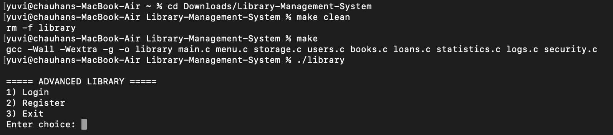
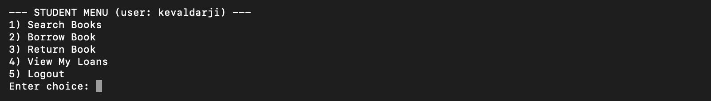
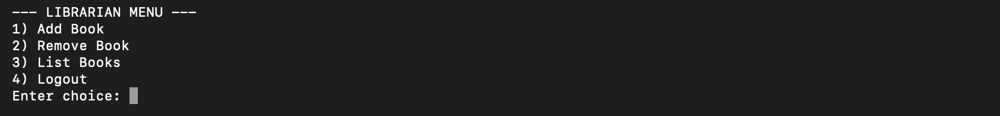
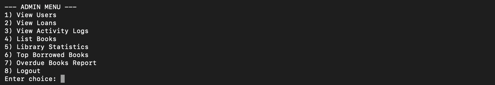
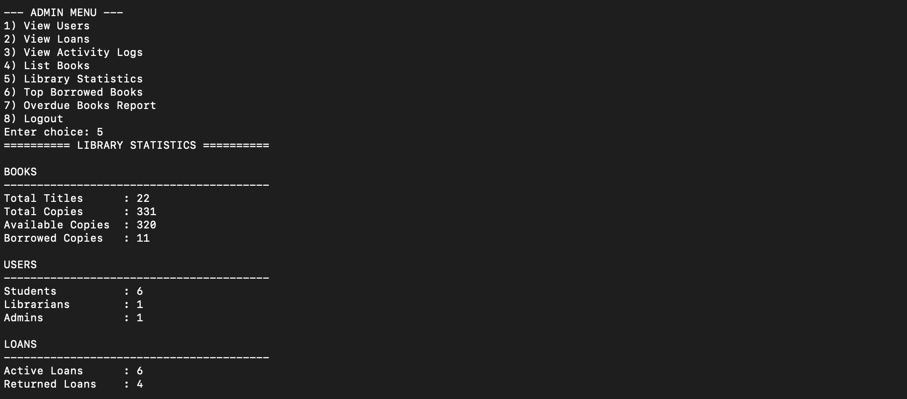
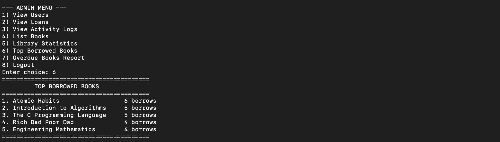

# 📚 Advanced Library Management System

<p align="center">


</p>

A **terminal-based Library Management System** developed in **C** using **modular programming**, **file handling**, and **role-based authentication**.

The application manages **books, users, loans, fines, and activity logs** while storing all data persistently in text files. It demonstrates practical implementation of data structures, file handling, authentication, and modular software design.

---

# ✨ Features

## 👤 Authentication

- User Registration
- Secure Login
- Password Hashing
- Password Validation
- Role-Based Access Control

---

## 📚 Book Management

- Add & Remove Books
- Search Books
- View Complete Book Catalog
- Automatic Book ID Generation
- Book Availability Tracking
- Book Popularity Tracking

---

## 📖 Loan Management

- Borrow Books
- Return Books
- Automatic Loan ID Generation
- Due Date Management
- Fine Calculation
- Personal Loan History
- Complete Loan Records

---

## 📊 Reports & Analytics

- Library Statistics
- Top Borrowed Books
- Overdue Books Report

---

## 📝 Activity Logging

Every important action is automatically recorded.

- User Registration
- Login / Failed Login
- Borrow Book
- Return Book
- Add Book
- Remove Book

---

# 👥 User Roles

| Student | Librarian | Administrator |
|:--------:|:----------:|:-------------:|
| Search Books | Add Books | View Users |
| Borrow Books | Remove Books | View Loans |
| Return Books | View Book Catalog | View Logs |
| View Personal Loans | | Library Statistics |
| | | Top Borrowed Books |
| | | Overdue Report |

---

# 📷 Application Screenshots

### Login Screen



### Student Menu



### Librarian Menu



### Administrator Menu



### Library Statistics



### Activity Logs



---

# 📁 Project Structure

```text
Library-Management-System
│
├── books.c / books.h
├── users.c / users.h
├── loans.c / loans.h
├── logs.c / logs.h
├── statistics.c / statistics.h
├── security.c / security.h
├── storage.c / storage.h
├── menu.c / menu.h
├── main.c
├── Makefile
│
├── data/
│   ├── users.txt
│   ├── books.txt
│   ├── loans.txt
│   └── logs.txt
│
├── screenshots/
├── README.md
└── .gitignore
```

---

# ⚙️ Technologies Used

- C Programming
- Modular Programming
- File Handling
- Dynamic Memory Allocation
- Password Hashing
- Makefile
- Command-Line Interface (CLI)

---

# 🚀 Build & Run

### Clone Repository

```bash
git clone https://github.com/yuvraj-chauhan13/Library-Management-System.git
```

### Compile

```bash
make
```

### Run

```bash
./library
```

---

# 💾 Data Storage

The application stores all information using plain text files.

| File | Description |
|------|-------------|
| `users.txt` | Registered Users |
| `books.txt` | Book Records |
| `loans.txt` | Loan Records |
| `logs.txt` | Activity Logs |

No external database is required.

---

# 📚 Key Concepts Demonstrated

- Modular Programming
- File Handling
- Authentication
- Password Hashing
- Role-Based Access Control
- Dynamic Memory Management
- Data Persistence
- Software Design
- Makefile Build System

---

# 🔮 Future Improvements

- Book Reservation System
- Search by Author / ISBN
- Email Notifications
- SQLite / MySQL Integration
- Graphical User Interface (GUI)

---

# 👨‍💻 Author

**Yuvraj Chauhan**

- GitHub: https://github.com/yuvraj-chauhan13
- LinkedIn: https://linkedin.com/in/yuvrajchauhan04

---
